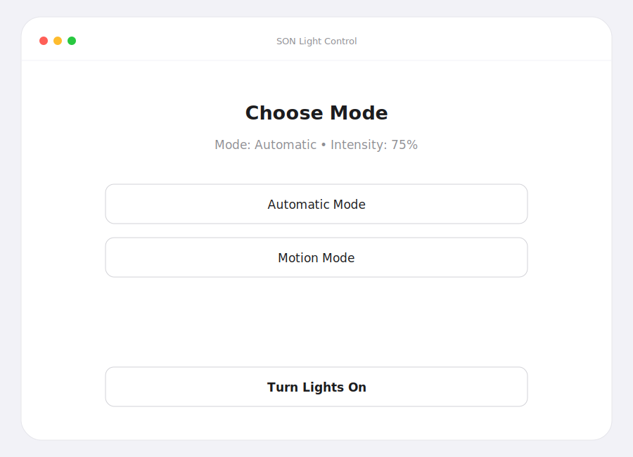
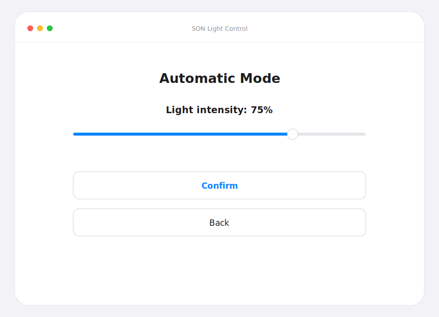
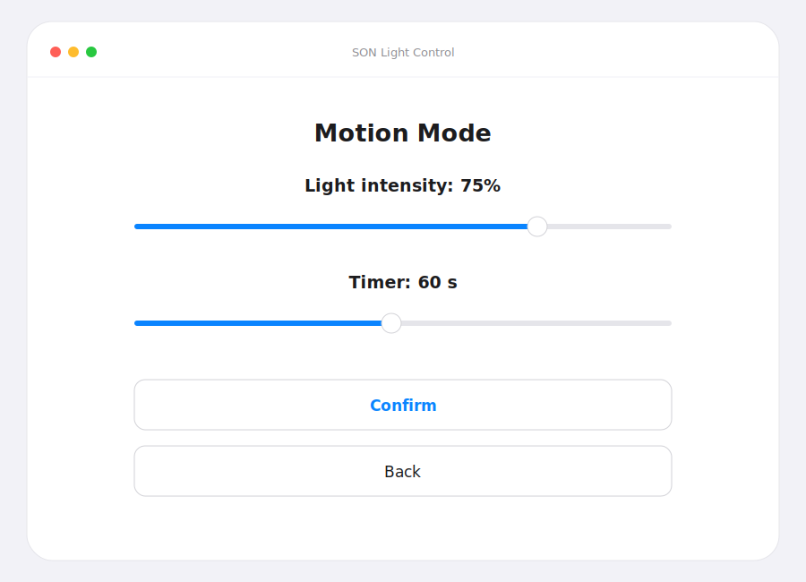
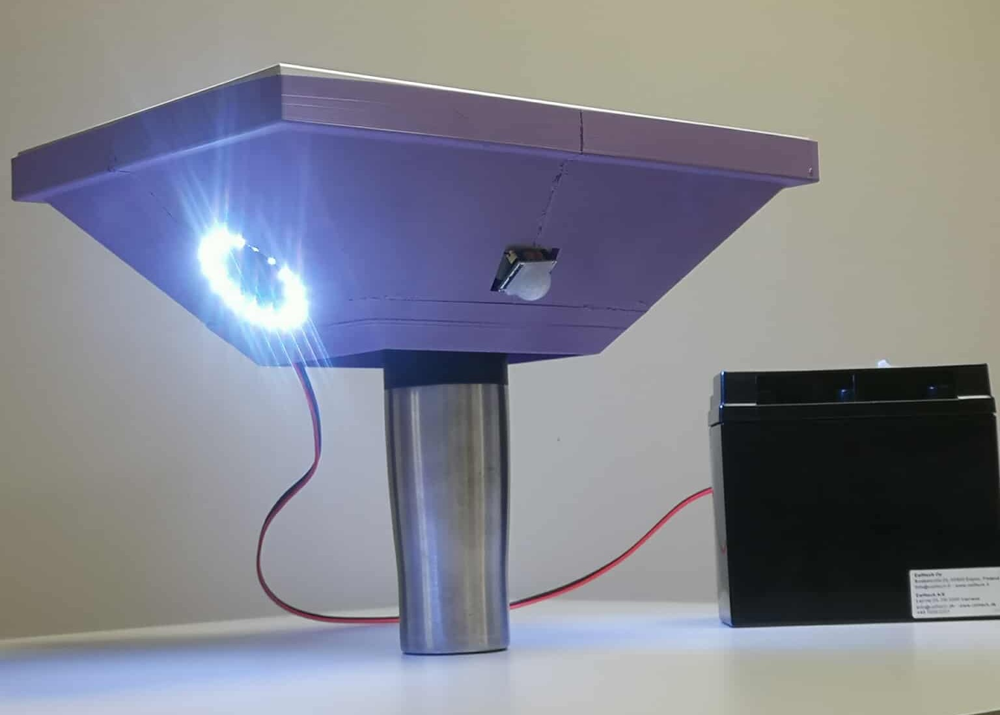
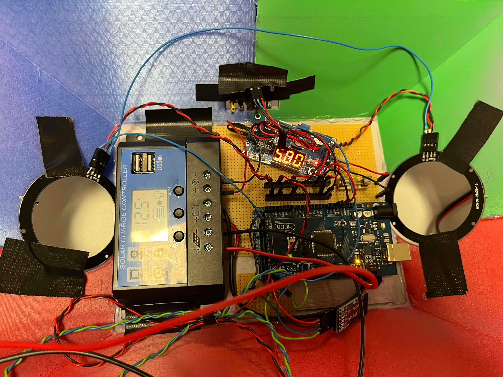

# SON: Solar-Powered Smart Lamp

An autonomous, solar-powered outdoor lamp built on a bare-metal ATmega2560, developed as a 2nd semester project at Aarhus University. The lamp decides when to light up on its own, either from ambient darkness or from detected motion, and is configured wirelessly from a Qt6 desktop app over Bluetooth. It runs entirely off a solar panel, charge controller and battery, with no mains power.

---

## What it does

SON has two operating modes, selectable and tunable from the desktop app. All settings survive a power cycle, they are persisted to the microcontroller's on-chip EEPROM.

### Automatic mode | ambient light

An I²C ambient light sensor is polled continuously. When the surroundings fall below a darkness threshold the LED ring fades up to the configured intensity; when it gets bright again the ring turns off. A hysteresis band (separate on/off thresholds) prevents flicker at dusk and dawn.

| Menu | Automatic mode |
|---|---|
|  |  |

### Motion mode | presence detection

The light sensor is disabled and a PIR motion sensor takes over. On detected motion the ring lights to the configured intensity and a countdown timer starts; when the timer expires the light fades out until the next movement. Both the intensity and the timeout (5–120 s) are set from the app.



---

## System overview

| The lamp in action | Electronics & power |
|---|---|
|  |  |

The firmware is written directly against the AVR hardware registers - no Arduino framework - and coordinates three independent peripheral buses at once:

```
                   ┌──────────────────────────── ATmega2560 ────────────────────────────┐
   TSL light   ──I²C (TWI)──▶                                                            
   sensor                     │  System (mode logic, EEPROM persistence, timer)          
   PIR motion  ──digital in──▶│    ├── Automatic: light threshold + hysteresis           
   sensor                     │    └── Motion:    PIR trigger + Timer1 countdown          
   HC-05 BT    ──UART (RX/TX)─▶    │                                                      
   module         9600 baud   │    ▼                                                      
                              WS2812B LED ring  ──SPI @ 10 MHz──▶  32-LED addressable ring
   Solar panel ─▶ charge controller ─▶ battery ─▶ 5 V rail (autonomous, no mains)         
                   └────────────────────────────────────────────────────────────────────┘
```

A companion **Qt6 desktop app** connects to the HC-05 Bluetooth module as a virtual serial port and drives the lamp through a compact ASCII command protocol. State is bidirectional: on connect the app requests the lamp's current settings and mirrors them in the UI, so the two always stay in sync.

Key technical points:

- **Bare-metal drivers** for every peripheral - I²C, SPI, UART and EEPROM are all driven through direct register access.
- **Timer1 in CTC mode** provides a 10 ms tick used for the motion timeout countdown.
- **Hysteresis** on the ambient-light decision eliminates on/off oscillation around the threshold.
- **EEPROM-backed settings** - mode, intensity, timer and power state are reloaded on boot.
- **Solar-powered and autonomous** - the whole system runs off a solar panel, charge controller and battery.

---

## Technology stack

| Category | Technology |
|---|---|
| Microcontroller | ATmega2560 (Arduino Mega 2560 board) |
| Firmware language | C / C++17, bare-metal (no Arduino framework) |
| LED output | WS2812B addressable RGB ring via SPI @ 10 MHz |
| Ambient light | TSL-family light sensor via I²C (TWI) |
| Motion sensing | PIR sensor (digital input) |
| Wireless link | HC-05 Bluetooth module over UART @ 9600 baud |
| Persistence | On-chip EEPROM |
| Timing | Timer1 (CTC, 10 ms tick) |
| Power | Solar panel + charge controller + battery |
| Desktop app | C++17 / Qt6 (Widgets, SerialPort) |
| Build | make + avr-gcc (firmware), CMake (desktop app) |

---

## Hardware setup

- Arduino Mega 2560 (ATmega2560)
- WS2812B addressable RGB LED ring
- TSL-family ambient light sensor (I²C)
- PIR motion sensor
- HC-05 Bluetooth module
- Solar panel, solar charge controller and battery
- 3D-printed lamp housing

---

## Building and running

### Firmware (Arduino Mega 2560)

Requires the AVR toolchain (`avr-gcc`, `avr-libc`, `avrdude`).

```bash
cd firmware
make                      # builds son-firmware.hex
make flash PORT=COM3      # upload to the board (set PORT to your device)
```

### Desktop app (Qt6)

Requires Qt6 with the Widgets and SerialPort modules.

```bash
cd desktop-app
cmake -B build && cmake --build build
./build/son-light-control
```

The app opens the serial port bound to the HC-05 module (default `COM3`, 9600 baud) and requests the lamp's current state on startup.

---

## How to use

1. Power the lamp and pair the HC-05 Bluetooth module with the host computer.
2. Launch the desktop app - it connects and mirrors the lamp's current settings.
3. Pick **Automatic Mode** or **Motion Mode** and set intensity (and, for motion, the timeout).
4. Press **Confirm** to apply - the setting is sent to the lamp and stored in EEPROM.
5. Use **Turn Lights On / Off** to toggle the lamp at any time.

### Command protocol

Commands are newline-terminated ASCII sent over the serial link. The lamp echoes its full state back so the app can stay in sync.

| Command | Meaning |
|---|---|
| `A0` / `A1` | Set mode - `0` = Automatic, `1` = Motion |
| `B<n>` | Set light intensity, `n` = 0–100 (%) |
| `C<n>` | Set motion timeout, `n` = seconds |
| `D0` / `D1` | Power the lamp off / on |
| `E` | Request current state |

The lamp replies with `A<mode>B<intensity>C<timer>D<running>`, which the app parses to update the UI.

---

## Project structure

```
.
├── README.md
├── report.pdf                 # Full project report (personal data removed)
│
├── firmware/                  # Bare-metal ATmega2560 firmware
│   ├── Makefile               # avr-gcc build - produces son-firmware.hex
│   ├── main.cpp               # Entry point + main control loop
│   ├── System/                # Mode logic, EEPROM persistence, feedback
│   ├── LEDDriver/             # WS2812B ring driver (SPI)
│   ├── LightDriver/           # Ambient light sensor driver (I²C)
│   ├── MotionDriver/          # PIR motion sensor driver
│   ├── Bluetooth/             # UART transport to the HC-05 module
│   └── Delay/                 # Timer1 CTC countdown
│
├── desktop-app/               # Qt6 control application
│   ├── CMakeLists.txt         # CMake build - produces son-light-control
│   ├── main.cpp               # Qt entry point
│   ├── mainwindow.cpp/.h      # UI logic and serial protocol
│   └── mainwindow.ui          # Qt Designer layout
│
└── docs/
    ├── system_in_action.jpg
    ├── electronics_overview.jpg
    ├── integration_test.jpg
    ├── screen_menu.svg
    ├── screen_automatic.svg
    └── screen_motion.svg
```

---

## Report

The full project report is available in [`report.pdf`](report.pdf). It covers the complete development process - requirements specification, technical analysis, system and hardware architecture (UML/SysML), software design with class, sequence and state-machine diagrams, module and integration testing, and an acceptance test against all functional and non-functional requirements.

---

## Team

2nd Semester - ECE Software Technology, Aarhus University

- Oskar Jentzsch Seeberg
